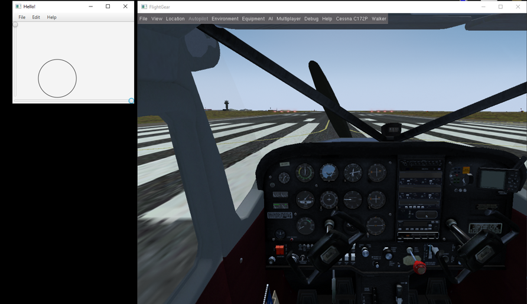

# javaFX-flightSimulator

Flight remote control in flight simulator.

## About 
The javaFX-flightSimulator it's a joystick that connects remotely to a flight simulator "FlightGear",
The joystick controls the flight of the aircraft. 

## Features:
* Joystick - stabilizes the height of the plane.
* Throttle - responsible for aircraft speed.
* Rudder - stabilizes the direction of the plane.

## Instruction 
Move the joystick (circle) by clicking and dragging the mouse on the rectangle surface. 
The lower slider controls the rudder, you can move the slider right or left to adjust the direction of the plane. 
The left slider controls the throttle, you can move the slider up to accelerate the plane, and lower the slider down to slow it down.

 

### For example:

Stabilize the direction of the plane with the rudder and pull the throttle.

Stabilize the height of the plane with the joystick.

